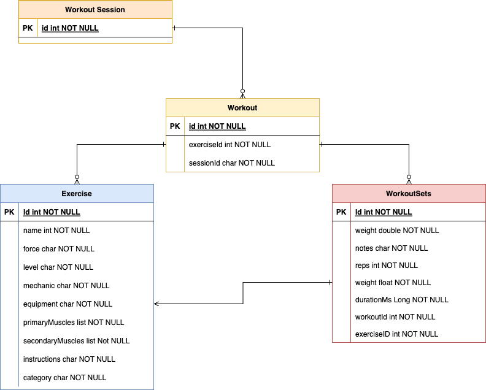
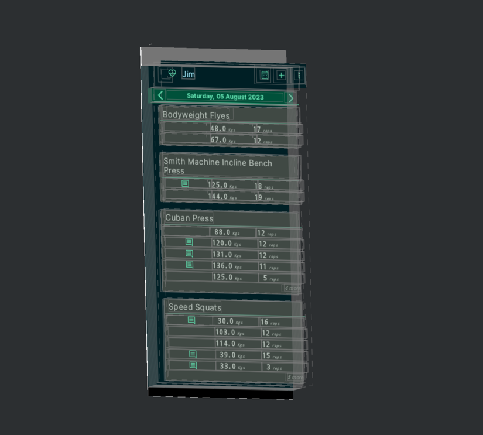

# Things to remember
- a day can have only one session
- a session can have only unique workouts-exercises, append if already there

# TODO
- in home screen add param to set the default dat, currently it's default to current day (in case when we go to session from calendar)

# Done
- Database refactor

# Wireframes
- Home Screen

